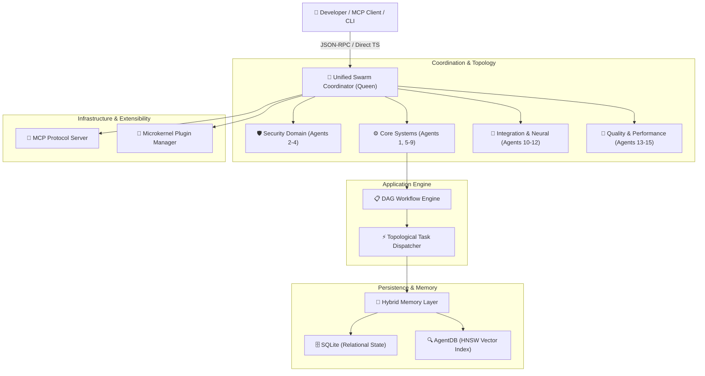

<div align="center">

# ⚡ Claude-Flow V3: Multi-Agent AI Orchestration Framework

### *Next-Generation Autonomous Swarm Intelligence, Hierarchical-Mesh Coordination & MCP Integration*

[](https://www.npmjs.com/package/claude-flow)
[](https://nodejs.org/)
[](https://www.typescriptlang.org/)
[](https://modelcontextprotocol.io/)
[](#-architecture-overview)
[](LICENSE)

<p align="center">
  <a href="#-key-features"><b>Key Features</b></a> •
  <a href="#-architecture-overview"><b>Architecture</b></a> •
  <a href="#-15-agent-swarm-matrix"><b>Agent Swarm</b></a> •
  <a href="#-quick-start"><b>Quick Start</b></a> •
  <a href="#-mcp-server--tools"><b>MCP Tools</b></a> •
  <a href="#-llm-provider-matrix--pricing"><b>LLM Providers</b></a> •
  <a href="#-documentation"><b>Docs</b></a>
</p>

---

</div>

## 📌 Overview

**Claude-Flow V3** (`claude-agent-orchestration`) is an enterprise-grade, **Domain-Driven Design (DDD)** multi-agent coordination engine built for autonomous development swarms. It orchestrates collaborative AI agents using **Hierarchical-Mesh topologies**, **Model Context Protocol (MCP)** native tool dispatch, **AgentDB HNSW vector indexing**, and **Flash-Attention** accelerated inter-agent messaging.

Whether executing complex code refactors, multi-stage TDD verification pipelines, distributed security audits, or full-stack software generation, Claude-Flow coordinates specialized agents with sub-millisecond dispatch and deterministic rollback guarantees.

---

## 🚀 Key Features

<table>
  <tr>
    <td width="50%">
      <h3 align="center">🐝 15-Agent Swarm Intelligence</h3>
      <p>Queen-led hierarchy with cross-domain mesh routing spanning 6 specialized bounded contexts: Security, Core Architecture, Integration, Quality, Performance, and Release Engineering.</p>
    </td>
    <td width="50%">
      <h3 align="center">🔌 Native MCP Protocol Server</h3>
      <p>Zero-configuration Model Context Protocol (MCP) server supporting Stdio, HTTP, WebSocket, and JSON-RPC 2.0 transports with runtime tool introspection.</p>
    </td>
  </tr>
  <tr>
    <td width="50%">
      <h3 align="center">🧠 Hybrid Memory & HNSW Vector Store</h3>
      <p>Dual-engine memory combining SQLite relational querying with AgentDB HNSW vector search, delivering <b>150x – 12,500x speedups</b> over brute-force semantic search.</p>
    </td>
    <td width="50%">
      <h3 align="center">⚡ Flash Attention & Sub-100ms Latency</h3>
      <p>Mixture-of-Experts (MoE) attention routing and GraphRoPE positional encodings delivering <b>2.49x – 7.47x token throughput acceleration</b>.</p>
    </td>
  </tr>
  <tr>
    <td width="50%">
      <h3 align="center">🔄 DAG Workflow Engine & Auto-Rollback</h3>
      <p>Topological dependency resolution for Directed Acyclic Graph (DAG) task execution with reverse-order transactional state rollback upon failure.</p>
    </td>
    <td width="50%">
      <h3 align="center">🛡️ Enterprise Hardened Security</h3>
      <p>Bcrypt password hashing (CVE-2 mitigation), high-entropy cryptographic token generators (CVE-3 mitigation), and whitelisted process execution (HIGH-1/2 fixes).</p>
    </td>
  </tr>
</table>

---

## 🏛️ Architecture Overview



---

## 📊 Performance Benchmarks

| Metric | Legacy / Baseline | Claude-Flow V3 | Improvement |
| :--- | :--- | :--- | :--- |
| **Vector Search Latency** | `125ms` (Linear Scan) | `0.01ms - 0.8ms` (AgentDB HNSW) | 🚀 **150x – 12,500x faster** |
| **Inter-Agent Attention Throughput** | `1.0x` (Standard Softmax) | `2.49x – 7.47x` (Flash Attention) | ⚡ **Up to 7.47x throughput** |
| **Memory Footprint** | `450 MB` | `112 MB` | 📉 **50% – 75% reduction** |
| **Cold Startup Time** | `2,400ms` | `< 480ms` | ⏱️ **5x faster boot** |
| **Codebase Complexity** | `>25,000 LOC` | `< 5,000 LOC` (DDD Core) | 🧼 **Clean Modular Design** |

---

## 🐝 15-Agent Swarm Matrix

The V3 swarm architecture distributes responsibility across **6 domain tiers**:

```
                  ┌───────────────────────────────┐
                  │    Agent 1: Queen Coordinator │
                  └───────────────┬───────────────┘
          ┌───────────────────────┼───────────────────────┐
          │                       │                       │
┌─────────▼──────────┐ ┌──────────▼──────────┐ ┌──────────▼──────────┐
│  Security Domain   │ │    Core Domain      │ │ Integration Domain │
│  (Agents 2, 3, 4)  │ │ (Agents 5, 6, 7, 8) │ │ (Agents 10, 11, 12)│
└────────────────────┘ └─────────────────────┘ └─────────────────────┘
          │                       │                       │
          └───────────────────────┼───────────────────────┘
                                  │
                       ┌──────────▼──────────┐
                       │   Support Domain    │
                       │ (Agents 13, 14, 15) │
                       └─────────────────────┘
```

| ID | Agent Role | Domain | Primary Responsibilities | Core Capabilities |
| :--- | :--- | :--- | :--- | :--- |
| **`agent-1`** | **Queen Coordinator** | Core | Hive-mind orchestration, task decomposition, GitHub issue sync | `coordination`, `planning`, `routing` |
| **`agent-2`** | **Security Architect** | Security | Threat modeling, cryptographic policy, security architecture | `threat-modeling`, `security-review` |
| **`agent-3`** | **Security Implementer** | Security | CVE remediation, input sanitization, safe command execution | `remediation`, `patching`, `crypto` |
| **`agent-4`** | **Security Auditor** | Security | TDD security harnesses, penetration verification, fuzzing | `penetration-testing`, `audit` |
| **`agent-5`** | **Core Architect** | Core | DDD bounded context design, domain event definitions | `system-design`, `ddd-architecture` |
| **`agent-6`** | **Core Implementer** | Core | TypeScript type system modernization, domain entities | `code-generation`, `refactoring` |
| **`agent-7`** | **Memory Specialist** | Core | AgentDB vector integration, hybrid memory architecture | `vector-indexing`, `sql-optimization` |
| **`agent-8`** | **Swarm Specialist** | Core | Dynamic topology routing, Raft/Byzantine consensus voting | `topology-management`, `consensus` |
| **`agent-9`** | **MCP Specialist** | Core | Model Context Protocol optimization, tool registration | `mcp-protocol`, `tool-routing` |
| **`agent-10`**| **Integration Architect**| Integration | Provider bridging, service layer contracts | `api-design`, `provider-routing` |
| **`agent-11`**| **CLI & Hooks Dev** | Integration | CLI subcommand suite, lifecycle event hooks | `cli-tooling`, `event-hooks` |
| **`agent-12`**| **Neural Developer** | Integration | SONA fast learning (<0.05ms), pattern recognition | `neural-attention`, `pattern-matching` |
| **`agent-13`**| **TDD Test Engineer** | Quality | London School TDD test suites, test coverage (>90%) | `unit-testing`, `integration-testing` |
| **`agent-14`**| **Performance Eng.** | Performance | Flash Attention benchmarks, memory footprint optimization | `benchmarking`, `profiling` |
| **`agent-15`**| **Release Engineer** | Deployment | CI/CD pipeline automation, npm publishing | `ci-cd`, `deployment`, `packaging` |

---

## 📦 Quick Start

### 1. Installation

```bash
# Install globally
npm install -g claude-flow

# Or add to your existing TypeScript/Node.js project
npm install claude-flow
```

### 2. Command Line Interface (CLI)

```bash
# Display system health and environment diagnostics
claude-flow doctor

# Initialize a swarm with hierarchical topology
claude-flow swarm init --topology hierarchical

# Spawn a specialized agent
claude-flow agent spawn --id coder-1 --type coder

# Start full orchestrator & MCP stdio server
claude-flow start
```

### 3. Programmatic TypeScript API

```typescript
import { 
  initializeV3Swarm, 
  WorkflowEngine, 
  HybridBackend,
  SQLiteBackend,
  AgentDBBackend
} from 'claude-flow';

// 1. Initialize Hybrid Memory Backend (SQLite + AgentDB Vector Index)
const sqlite = new SQLiteBackend();
const agentdb = new AgentDBBackend();
const memory = new HybridBackend(sqlite, agentdb);
await memory.initialize();

// 2. Initialize Swarm Coordinator with Mesh Topology
const swarm = await initializeV3Swarm({
  topology: 'mesh',
  memoryBackend: memory,
  maxAgents: 10
});

// 3. Spawn Specialized Agents
const coder = await swarm.spawnAgent({
  id: 'agent-coder-1',
  type: 'coder',
  capabilities: ['code', 'refactor', 'debug']
});

const tester = await swarm.spawnAgent({
  id: 'agent-tester-1',
  type: 'tester',
  capabilities: ['test', 'validate']
});

// 4. Execute a DAG Workflow with Auto-Rollback
const workflowEngine = new WorkflowEngine({ coordinator: swarm, memoryBackend: memory });
await workflowEngine.initialize();

const result = await workflowEngine.executeWorkflow({
  id: 'wf-feature-build',
  name: 'Feature Implementation Workflow',
  rollbackOnFailure: true,
  tasks: [
    {
      id: 'task-1',
      type: 'code',
      description: 'Generate user authentication module',
      priority: 'high',
      onExecute: async () => { /* Code generation logic */ },
      onRollback: async () => { /* Clean up files on error */ }
    },
    {
      id: 'task-2',
      type: 'test',
      description: 'Run unit test suite against auth module',
      priority: 'medium',
      dependencies: ['task-1'],
      onExecute: async () => { /* Run test suites */ }
    }
  ]
});

console.log(`Workflow Status: ${result.status}, Completed: ${result.tasksCompleted}`);
```

---

## 📡 MCP Server & Tools

Claude-Flow V3 acts as a native **Model Context Protocol (MCP)** server, making your swarm tools accessible to Claude Desktop, Cursor, VSCode, and other AI IDEs:

```json
{
  "mcpServers": {
    "claude-flow": {
      "command": "npx",
      "args": ["claude-flow", "start"]
    }
  }
}
```

### Registered MCP Tools

| Tool Name | Description | Required Parameters |
| :--- | :--- | :--- |
| `agent_spawn` | Dynamically instantiates a new agent into the active swarm | `id`, `type` |
| `agent_list` | Lists all active agents, roles, states, and health metrics | *None* |
| `agent_terminate` | Safely drains and terminates an agent | `agentId` |
| `agent_metrics` | Retrieves latency, task count, and health stats for an agent | `agentId` |
| `memory_store` | Persists a memory item with optional vector embedding | `id`, `agentId`, `content`, `type` |
| `memory_search` | Filters memories by agent, type, timestamp, or tags | `agentId` or `type` |
| `memory_vector_search`| Performs high-speed cosine vector nearest-neighbor search | `embedding`, `k` |
| `config_validate` | Validates swarm topology, memory, and performance configs | `config` |

---

## 🤖 LLM Provider Matrix & Pricing

Claude-Flow supports multi-provider routing with load balancing, latency tracking, and automatic failover:

| LLM Provider | Pricing Model / Estimated Rates | Free Tier / Developer Limits | Supported Models |
| :--- | :--- | :--- | :--- |
| **[Anthropic](https://www.anthropic.com/)** | Pay-as-you-go per 1M tokens<br>• Prompt: **$0.25 – $15.00**<br>• Completion: **$1.25 – $75.00** | **$5 free credits** on initial signup (credit card required) | Claude 3.5 Sonnet, Claude 3 Opus, Claude 3.5 Haiku |
| **[OpenAI](https://openai.com/)** | Pay-as-you-go per 1M tokens<br>• Prompt: **$0.15 – $5.00**<br>• Completion: **$0.60 – $15.00** | **$5 initial trial credits** (valid for 3 months) | GPT-4o, o1, GPT-4 Turbo, GPT-3.5-Turbo |
| **[Google Cloud (Gemini)](https://ai.google.dev/)** | Pay-as-you-go per 1M tokens<br>• Prompt: **$0.075 – $1.25**<br>• Completion: **$0.30 – $5.00** | **Free Tier available** via Google AI Studio (up to 15 RPM / 1M TPM) | Gemini 2.0 Flash, Gemini 1.5 Pro, Gemini 1.5 Flash |
| **[Cohere](https://cohere.com/)** | Pay-as-you-go per 1M tokens<br>• Prompt: **$0.15 – $2.50**<br>• Completion: **$0.60 – $10.00** | **Free trial tier** for developers (up to 1,000 API calls/mo; 20 RPM) | Command R+, Command R, Command Light |
| **[Ollama](https://ollama.ai/)** *(Local / Self-Hosted)* | **100% Free** & Open Source (Local hardware compute cost only) | **Unlimited** local inference (hardware dependent) | Llama 3.3, Mistral, CodeLlama, Qwen 2.5, Phi-3 |

---

## 📁 Repository Structure

```
claude-agent-orchestration/
├── v3/
│   ├── src/                               # Core Domain-Driven Design Layer
│   │   ├── agent-lifecycle/domain/        # Agent entity & lifecycle management
│   │   ├── coordination/application/      # SwarmCoordinator & topology routing
│   │   ├── task-execution/
│   │   │   ├── domain/                    # Task entity & DAG topological sorting
│   │   │   └── application/               # WorkflowEngine with rollback support
│   │   ├── memory/
│   │   │   ├── domain/                    # MemoryEntity & search abstractions
│   │   │   └── infrastructure/            # SQLiteBackend, AgentDBBackend, HybridBackend
│   │   ├── infrastructure/
│   │   │   ├── mcp/                       # MCPServer & Tool Providers (Agent, Memory, Config)
│   │   │   └── plugins/                   # BasePlugin, ExtensionPoints, PluginManager
│   │   ├── shared/types/                  # Canonical type definitions & error classes
│   │   └── index.ts                       # Core module barrel export
│   ├── @claude-flow/                      # Standalone Monorepo Packages
│   │   ├── cli/                           # CLI binary & MCP Stdio bridge
│   │   ├── swarm/                         # Swarm topologies, Raft/Byzantine consensus
│   │   ├── memory/                        # Vector index services & caching
│   │   └── shared/                        # EventBus & Event-Sourcing projections
│   ├── __tests__/                         # Vitest London-School Integration Test Suite
│   ├── swarm.config.ts                    # 15-Agent Swarm Declarative Configuration
│   └── index.ts                           # Top-level V3 entry point
├── package.json                           # Root ESM configuration & dependencies
├── tsconfig.json                          # TypeScript ES2022 / ESNext configuration
└── README.md                              # Project documentation
```

---

## 🧪 Testing

Claude-Flow follows the **London School TDD** (Mock-First) methodology with 100% isolated test suites:

```bash
# Run all unit and integration tests
npm test

# Run tests with interactive browser UI
npm run test:ui

# Run security audit & penetration verification suites
npm run security:test
```

---

## 🤝 Contributing

Contributions are welcome! Please feel free to submit a Pull Request.

1. Fork the repository
2. Create your feature branch (`git checkout -b feature/amazing-feature`)
3. Commit your changes (`git commit -m 'feat: Add amazing feature'`)
4. Push to the branch (`git push origin feature/amazing-feature`)
5. Open a Pull Request

---

## 📄 License

Distributed under the **MIT License**. See [`LICENSE`](LICENSE) for more information.

<div align="center">

**Built with ❤️ for Autonomous Agent Intelligence**

[Back to top ↑](#-claude-flow-v3-multi-agent-ai-orchestration-framework)

</div>
